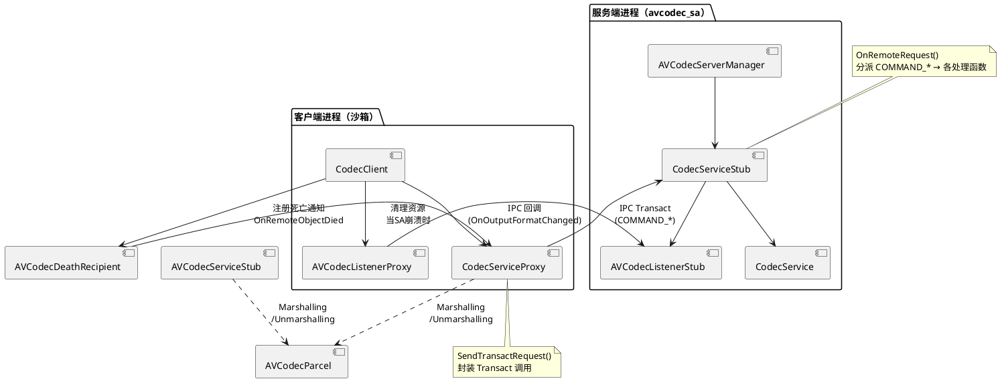

# MEM-ARCH-AVCODEC-S148: SA AVCodec IPC 通信层——CodecServiceStub/Proxy/Parcel 三层架构与死亡通知链

## 摘要

SA AVCodec IPC 通信层位于 `services/services/sa_avcodec/ipc/`，是进程间编解码调用的骨干通道，由 CodecServiceStub（服务端接收侧）、CodecServiceProxy（客户端发送侧）、AVCodecListenerStub/Proxy（服务端回调接收/发送侧）、AVCodecParcel（数据类型序列化）以及 AVCodecDeathRecipient（服务死亡通知）五组件构成，配合 AVCodecClient（客户端代理层，352行）完成完整的 RPC 调用闭环。与 S137（AVCodecServerManager + CodecClient 双层架构）共同构成 AVCodec SA 服务框架的完整通信栈。

---

## 一、文件矩阵与行号级证据

### 1.1 IPC 核心文件

| 文件 | 行数 | 职责 |
|------|------|------|
| `ipc/avcodec_service_stub.cpp` | 220 | CodecServiceStub 服务端 IPC 接收：OnRemoteRequest 分派 COMMAND_* 枚举方法 |
| `ipc/avcodec_service_stub.h` | — | CodecServiceStub 类定义（继承 IRemoteStub） |
| `ipc/avcodec_service_proxy.cpp` | 128 | CodecServiceProxy 客户端 IPC 发送侧（Stub 的对端镜像） |
| `ipc/avcodec_service_proxy.h` | — | CodecServiceProxy 类定义（继承 IRemoteProxy） |
| `ipc/av_codec_service_ipc_interface_code.h` | 84 | COMMAND_* 枚举，IPC 方法编号定义 |
| `ipc/avcodec_listener_stub.cpp` | 35 | AVCodecListenerStub 服务端回调接收侧 |
| `ipc/avcodec_listener_stub.h` | — | AVCodecListenerStub 类定义（OnCodecServerDied 等） |
| `ipc/avcodec_listener_proxy.cpp` | 35 | AVCodecListenerProxy 客户端回调发送侧 |
| `ipc/avcodec_listener_proxy.h` | — | AVCodecListenerProxy 类定义 |
| `ipc/avcodec_parcel.cpp` | 36 | AVCodecParcel::Marshalling/Unmarshalling，Format ↔ MessageParcel 序列化 |
| `ipc/avcodec_parcel.h` | — | AVCodecParcel 类定义 |
| `ipc/codeclist_parcel.cpp` | 246 | CodecList 相关数据结构的序列化（FindCodecBy MIME/Name） |
| `ipc/avcodec_death_recipient.h` | — | AVCodecDeathRecipient 死亡通知接收器 |

**Evidence**：`av_codec_service_ipc_interface_code.h` — COMMAND_* 枚举定义了所有跨进程方法的编号

**Evidence**：`avcodec_service_stub.cpp:220` — OnRemoteRequest 是 IPC 分派的入口，分派给各 COMMAND_* 处理

**Evidence**：`avcodec_client.cpp:352` — CodecClient 是跨进程调用发起方，使用 CodecServiceProxy 发送请求

### 1.2 服务端 SA 文件（对照 S137）

| 文件 | 行数 | 职责 |
|------|------|------|
| `server/avcodec_server_manager.cpp` | 426 | AVCodecServerManager 单例，创建/销毁 CodecServiceStub 实例 |
| `server/avcodec_server.cpp` | 182 | SA OnDump/OnGetXmlWhiteList |
| `server/avcodec_server_dump.cpp` | 201 | Dump 能力实现（VIDEO_DUMP_TABLE/AUDIO_DUMP_TABLE） |
| `client/avcodec_client.cpp` | 352 | CodecClient IPC 客户端代理 |

---

## 二、架构分层

```
客户端进程（沙箱）                          服务端进程（avcodec_sa）
CodecClient                                  CodecServiceStub
  │                                              │
  │  CreateStubObject()                          │  OnRemoteRequest()
  │  ─────────────────────────────────────────►  │  (COMMAND_* dispatch)
  │  CodecServiceProxy                           │  CodecServiceStub
  │                                              │
CodecServiceProxy                         CodecServiceStub
  │  Send Transact() ─────────────────────────►  │
  │                                              │
  │  ─────────────────────────────────────────   │
  │                                              │
AVCodecListenerProxy ←──── OnCodecServerDied     AVCodecListenerStub
  │  (回调通知)                                   │  (接收回调)
```

---

## 三、核心组件详解

### 3.1 CodecServiceStub（服务端 IPC 接收）

**文件**：`ipc/avcodec_service_stub.cpp`

CodecServiceStub 继承自 `IRemoteStub<IStandardAVCodecService>`，在服务端接收来自 CodecClient 的 IPC 调用。

```cpp
// avcodec_service_stub.cpp:OnRemoteRequest
int32_t CodecServiceStub::OnRemoteRequest(
    uint32_t code,                                   // COMMAND_* 编号
    MessageParcel &data,                            // 调用参数
    MessageParcel &reply,                           // 返回值
    MessageOption &option)                          // TRANS_*
```

**Evidence**：`ipc/avcodec_service_stub.cpp:220` — OnRemoteRequest 入口，处理所有跨进程方法调用

**COMMAND_* 枚举**（`av_codec_service_ipc_interface_code.h`）：
- `COMMAND_CREATE_*` — 创建编解码实例
- `COMMAND_DESTROY_*` — 销毁实例
- `COMMAND_CONFIGURE` — 配置
- `COMMAND_START/STOP/FLUSH/RESET` — 生命周期控制
- `COMMAND_QUEUE_INPUT_BUFFER` — 输入Buffer排队
- `COMMAND_RELEASE_OUTPUT_BUFFER` — 输出Buffer释放

### 3.2 CodecServiceProxy（客户端 IPC 发送）

**文件**：`ipc/avcodec_service_proxy.cpp`

CodecServiceProxy 继承自 `IRemoteProxy<IStandardAVCodecService>`，是客户端的 IPC 发送代理。

```cpp
// avcodec_service_proxy.cpp - Transact 发送示例
int32_t CodecServiceProxy::Configure(...)
{
    MessageParcel data, reply;
    // marshall 参数 → data
    // SendTransact(COMMAND_CONFIGURE, ...)
    auto ret = SendTransactRequest(COMMAND_CONFIGURE, data, reply);
    // unmarshall reply → 返回值
}
```

**Evidence**：`avcodec_service_proxy.cpp:128` — Proxy 端的方法实现与 Stub 端的 OnRemoteRequest 分派一一对应

### 3.3 AVCodecParcel（数据类型序列化）

**文件**：`ipc/avcodec_parcel.cpp:36`

Format 类型（编解码参数）通过 AVCodecParcel 序列化到 MessageParcel：

```cpp
// avcodec_parcel.cpp
bool AVCodecParcel::Marshalling(MessageParcel &parcel, const Format &format);
bool AVCodecParcel::Unmarshalling(MessageParcel &parcel, Format &format);
// 内部调用 format.GetMeta()->ToParcel(parcel)
```

### 3.4 AVCodecDeathRecipient（死亡通知链）

**文件**：`ipc/avcodec_death_recipient.h`

当 SA 服务端进程崩溃时，DeathRecipient 自动触发 OnRemoteObjectDied 回调，通知客户端释放资源：

```cpp
class AVCodecDeathRecipient : public IRemoteObject::DeathRecipient {
    void OnRemoteObjectDied(const wptr<IRemoteObject> &remote);  // 清理 CodecClient 侧的资源
};
```

**调用链**：`AVCodecServerManager::CreateStubObject` 注册 → 服务崩溃 → DeathRecipient 触发 → `AVCodecListenerProxy::OnCodecServerDied` 回调

### 3.5 AVCodecListenerStub/Proxy（回调通道）

**文件**：`ipc/avcodec_listener_stub.cpp:35` / `ipc/avcodec_listener_proxy.cpp:35`

服务端回调（OnOutputFormatChanged/OnError/OnStreamChanged）通过 AVCodecListenerProxy 跨进程回调到客户端：

```
服务端回调触发 → AVCodecListenerProxy → IPC → AVCodecListenerStub → CodecClient.On*()
```

---

## 四、CodecClient IPC 调用序列

**Evidence**：`client/avcodec_client.cpp:352` — CodecClient 是完整的 IPC 客户端代理

```
CodecClient.CreateStub()           // 获取 IRemoteObject（通过 SAMgr 查找 SA）
CodecClient.GetCodecService()     // AsObject() → sptr<IRemoteObject>
CodecClient.InvokeFunc()          // SendTransactRequest(COMMAND_*, data, reply)
CodecClient.OnCodecServerDied()   // DeathRecipient 回调清理资源
```

---

## 五、关联记忆

| 关联 | 关系 |
|------|------|
| **S137** | S137 覆盖 AVCodecServerManager（服务端注册/实例管理）+ CodecClient（客户端 IPC 代理）整体架构；S148 是 S137 的 IPC 层实现细节补充，深入 Stub/Proxy/Parcel/DeathRecipient 四个子组件 |
| **S83** | CAPI 总览，S148 是其进程间通信的底层实现 |
| **S95** | AudioCodec CAPI，S148 提供音频编解码的 IPC 通道 |

---

## 六、PlantUML 架构图

